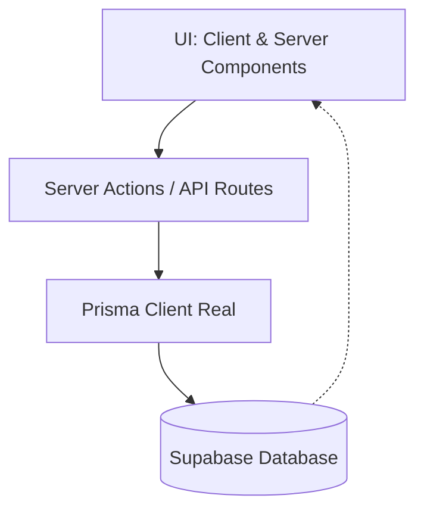

# Puntos Críticos de Migración: Data Falsa a Base de Datos Real

Este documento detalla los componentes, archivos y patrones que actualmente dependen de datos simulados (mock data) y que deben ser corregidos para asegurar que toda la información persista en la base de datos real (Supabase/Prisma).

## 1. El Objeto "prisma" Falso (`@/lib/mock-database`)
El problema más grave es la existencia de una clase `MockPrismaClient` que se hace pasar por Prisma pero guarda todo en la memoria del servidor.

- **Archivo Crítico:** `lib/mock-database.ts`
- **Impacto:** Cualquier endpoint que importe `prisma` desde este archivo **perderá los datos** cuando el servidor se reinicie.
- **Ejemplo Detectado:** `app/api/users/[id]/renewal/reject/route.ts` usa este mock directamente.
- **Acción:** Reemplazar estos imports por el cliente de Prisma real (`@/lib/prisma` o similar) y eliminar este archivo una vez terminada la migración.

## 2. Estado Global con Zustand (`@/lib/blacksheep-store.ts`)
Zustand se está utilizando actualmente no solo para UI, sino como una base de datos temporal en el cliente.

- **Inicialización con Mock Data:** El store se inicializa con `initialUsers`, `initialPlans`, etc., provenientes de `lib/mock-data.ts`.
- **Acciones In-Memory:** Funciones como `addUser`, `updateUser` y `deleteUser` (líneas 69-71 del store) modifican el array local en lugar de hacer llamadas `fetch` a la base de datos.
- **Datos Hardcodeados:** El array `egresos` está definido directamente dentro del código del store.
- **Riesgo:** Los cambios hechos por el usuario parecen funcionar en la pantalla, pero desaparecen al refrescar la página porque nunca llegaron al backend.

## 3. DataProvider Factory (`@/lib/data-layer/provider-factory.ts`)
El sistema está diseñado para alternar entre "mock" y "prisma".

- **Configuración por Defecto:** Actualmente, si no se define `DATA_PROVIDER=prisma` en las variables de entorno, el sistema usa `mock` por defecto en desarrollo.
- **Acción:** Forzar el uso de `prisma` en todos los entornos y eliminar la lógica de `MockDataProvider`.

## 4. Servicios y Repositorios Mixtos
Muchos servicios heredan de `BaseService` y usan un sistema de repositorios que aún mantiene implementaciones mock.

- **Ubicación:** `lib/data-layer/repositories/`
- **Archivos a revisar:**
  - `user-repository.ts`
  - `class-repository.ts`
  - `discipline-repository.ts`
  - `plan-repository.ts`
- **Problema:** Si el `provider-factory` devuelve un mock repository, los servicios como `UserService` leerán y escribirán en la memoria local en lugar de en la base de datos.

## 5. Rutas de API con Dependencias Ocultas
Algunas rutas de API podrían estar usando `getDataProvider()` que, bajo ciertas condiciones (como falta de variables de entorno), podría estar devolviendo el proveedor mock silenciosamente.

- **Monitoreo:** `lib/monitoring/health-checks.ts` parece estar vinculado a este sistema y podría dar falsos positivos de salud si el mock está "sano".

## Recomendaciones Inmediatas

1. **Sincronización de Zustand:** El store de Zustand solo debe usarse para **caché local** de lo que viene de la API. Todas las acciones de escritura (`POST`, `PUT`, `DELETE`) deben ejecutarse primero en la API y luego actualizar el store con la respuesta real.
2. **Eliminación de Imports de Mock-Database:** Buscar en todo el proyecto cualquier referencia a `lib/mock-database` y cambiarla por el cliente Prisma real.
3. **Variables de Entorno:** Asegurar que `DATABASE_URL` y `DATA_PROVIDER=prisma` estén correctamente configurados en el entorno local y en producción (Vercel).
4. **Limpieza de Dependencias:** Si se decide que Zustand no es necesario para el estado global (Next.js 15+ con Server Components reduce mucho esta necesidad), se podría simplificar eliminándolo, aunque para una SPA dinámica sigue siendo útil si se usa correctamente para UI.

---

## 🚀 Hoja de Ruta y Priorización (Orden de Ejecución)

No todas las tareas tienen el mismo impacto. Para evitar "arreglar el frente" mientras el "fondo" sigue roto, se debe seguir este orden:

1.  **🔥 Fase 1: Eliminar el Corazón del Mock:** 
    *   Borrar `MockPrismaClient` y referencias directas a `lib/mock-database.ts`.
    *   Forzar `DATA_PROVIDER=prisma` en todas las configuraciones.
    *   **✅ Criterio de éxito:** `grep -r "mock-database" .` devuelve 0 resultados y el servidor falla si no hay `DATABASE_URL`.
2.  **🔥 Fase 2: Saneamiento de Escritura:** 
    *   Eliminar todas las mutaciones directas en Zustand (`addUser`, `updateUser`, etc.) que no pasen por una API o Server Action.
    *   **✅ Criterio de éxito:** Al crear un usuario, el refresco de pantalla mantiene el dato (persistencia real confirmada).
3.  **⚠️ Fase 3: Limpieza de Infraestructura:** 
    *   Eliminar `MockDataProvider` y los repositorios mock en `lib/data-layer/repositories/`.
    *   **✅ Criterio de éxito:** El código compila sin rastros de clases "Mock" en la capa de datos.
4.  **🧹 Fase 4: Optimización de Arquitectura:** 
    *   Migrar el fetching de datos de Zustand a Server Components.
    *   Implementar SWR o React Query solo si se requiere caché avanzado en el cliente.
    *   **✅ Criterio de éxito:** Reducción del bundle size client-side y eliminación de `initialUsers` en el store.

## 🏗️ Arquitectura de Destino (Estado Final)

El objetivo es una arquitectura limpia donde la base de datos es la **única fuente de verdad**:

*   **❌ NO** existe lógica de datos persistentes en el cliente (Zustand).
*   **❌ NO** existe fallback a datos mock bajo ninguna circunstancia.
*   **✅ La DB** es la única fuente de verdad; la UI solo refleja lo que hay en ella.

## 🏆 Regla de Oro y Veredicto Técnico

### 📜 La Regla de Oro
> **"NUNCA se modifica un estado crítico o persistente sin pasar primero por el backend."**

Cualquier cambio que el usuario vea en pantalla debe ser la confirmación de una operación exitosa en la base de datos, no una simulación local.

### 🧠 Veredicto sobre Zustand
*   **ELIMINAR PARA:** Usuarios, Planes, Clases, Egresos y cualquier dato que deba persistir.
*   **NUNCA USAR COMO CACHÉ:** Zustand **NO es un sistema de caché de datos del backend**. No lo uses para guardar resultados de `fetchUsersOnce()` o similares. Para caché real, usa SWR o React Query.
*   **MANTENER (OPCIONAL) PARA:** Estado de la UI global (modales abiertos, sidebars, tabs activos, filtros de búsqueda temporales).
*   **Aclaración sobre PWA:** Una PWA ayuda con el rendimiento offline y assets, pero **no reemplaza** el manejo de estado ni el caché de datos. No dependas de la PWA para sincronizar información del negocio.

### 🔁 Estrategia de Revalidación (Next.js Sync)
Para asegurar que la UI esté siempre sincronizada con la base de datos sin usar Zustand como caché:
1.  **Escritura:** Ejecutar Server Action o API Call.
2.  **Revalidación:** Llamar a `revalidatePath()` o `revalidateTag()` en el servidor, o `router.refresh()` en el cliente.
3.  **Reflejo:** El Server Component se vuelve a ejecutar y envía la data fresca a la UI automáticamente.
    *   👉 *Nunca confiar en el estado previo del cliente después de una operación crítica.*

---

## 🛠️ Checklist de Validación Operativa (Check-out)

Antes de dar por cerrada la migración, verifica estos puntos:

- [ ] **Búsqueda ciega:** ¿Buscar "mock" en la carpeta `lib` y `app/api` da 0 resultados funcionales?
- [ ] **Persistencia forzada:** ¿Si creo un usuario y reinicio el servidor (o apago/prendo la terminal), el usuario sigue ahí?
- [ ] **Logs de conexión:** ¿Los logs de Prisma en desarrollo muestran queries reales a la base de datos (PostgreSQL/Supabase)?
- [ ] **Independencia de Store:** ¿Si vacío el array de `initialUsers` en `mock-data.ts`, la aplicación sigue mostrando los usuarios reales?
